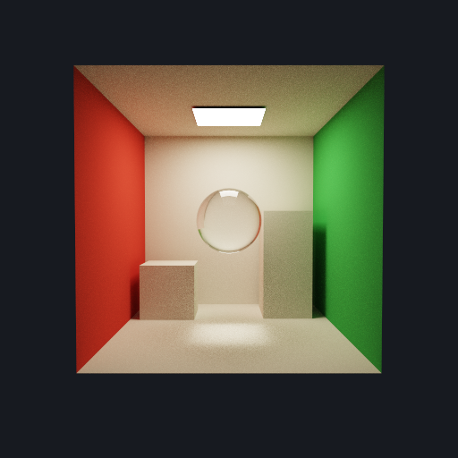
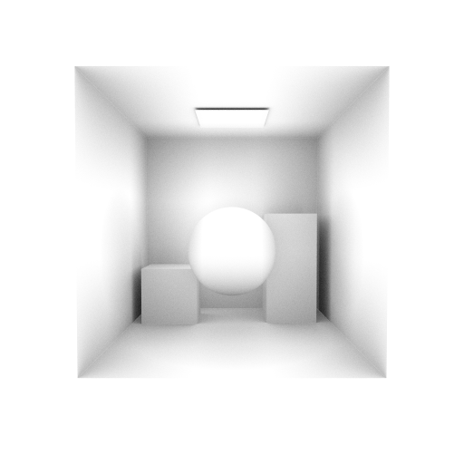

# Cornell path tracer

The Cornell sample traces diffuse indirect lighting, soft area-light shadows, and refractive
caustics from a floating glass sphere. Its center is `(0, 0.75, 0)` and radius is `0.4` in a 2×2×2
room, leaving `0.35` units of floor clearance. This is larger and lower than the initial sphere,
so the caustic is more concentrated. **The sphere uses custom intersection programs over one AABB,
not a triangle mesh.**
Glass uses Fresnel reflection/refraction, total internal reflection, and distance-dependent
absorption. An ambient-occlusion view makes nearby occluders visible.

## What changed

- Structural Slang, legacy Slang, and hand-written Metal render the same scene and integrator.
- Structural and legacy Slang share the material/sampling implementation, with separate tracing
  adapters implementing `ISceneTracer`. Both pipeline modules import `common/path_tracing.slang`,
  `common/sphere_intersection.slang`, and `common/scene_types.slang`. The integrator takes explicit
  frame data, resources, and the initial camera hit; the legacy adapter preserves its native
  payload layout and converts its result to the common hit type. No Slang preprocessor includes
  or `.slangh` files remain; CPU tests enforce this convention.
  This keeps their comparison focused on the ray-tracing API.
- Ray generation iteratively traces multiple bounces. Closest-hit returns a position, distance,
  normal, and material index; a separate small payload serves shadow and AO rays.
- The host builds separate triangle and procedural-AABB acceleration structures. Sphere
  intersection programs solve the quadratic, try near/far roots within the ray interval, and
  pass a 12-byte normal attribute to closest-hit. This includes rays exiting from inside glass.
  `--sphere diffuse` and `--sphere none` are visual controls.
- Triangle primary/shadow SBT records are 1/4; sphere records are 9/12 via instance contribution
  8. Each instance's user ID supplies its material-buffer base. Metal uses a records-buffer
  instance-path table for this contribution; its native intersection-function slots are 0/1
  for triangle/bounding-box candidates, independently of the physical SBT record numbers.
- `--view beauty` includes indirect illumination. `--view direct` stops after direct illumination
  at the first diffuse surface, while preserving preceding glass interactions. `--view ao`
  displays finite-radius hemispherical visibility.
- Sample accumulation uses linear radiance; exposure, tone mapping, and display encoding are
  applied afterward. A fixed seed makes repeated runs reproducible on a given backend.
- Interactive windows accumulate one sample per frame, reset when the camera or size changes,
  and show FPS and accumulated samples. Metal now drains autoreleased objects each frame.
- Portable C++ tests check argument validation, the shared CPU/GPU frame layout and SBT selectors,
  and assert that the sphere adds one AABB and no triangle vertices, with the requested center,
  radius, and glass/diffuse/no-sphere variants.

Beauty already includes occlusion through path visibility. AO is a separate diagnostic view;
it is not multiplied into the beauty image, which would artificially darken the illumination.

## Run it

Linux, using a compiler built from the current RT branch:

```bash
export SLANG_REPO=/path/to/slang
export SLANG_BUILD="$SLANG_REPO/build"
export SLANG_CONFIG=RelWithDebInfo
./run-linux.sh --backend vulkan --headless --samples 256 --bounces 8 \
    --sphere glass --view beauty --output cornell-pathtracer.ppm
```

Use `--api legacy` for the comparison, or `--backend optix --headless` for OptiX. Remove
`--headless` for the Vulkan interactive display. Linux OptiX interactive display is disabled for
safety; see the integration limitation below. Use `--view ao --ao-radius 0.75 --ao-samples 8`
for the AO diagnostic.

On macOS, the generated Metal and reflection files must come from the same compiler invocation:

```bash
METAL_CPP_DIR=/path/to/metal-cpp ./run-macos.sh --headless \
    --implementation structural --samples 256 --bounces 8 \
    --sphere glass --view beauty --output cornell-pathtracer.ppm
```

Use `--implementation native` for the hand-written Metal comparison.

After building on Windows with `run-windows.ps1`, the executable accepts the same renderer options:

```powershell
./build/windows/Release/structural-rt-cornell-rhi.exe shaders --backend d3d12 `
    --api structural --headless --samples 256 --bounces 8 `
    --sphere glass --view beauty --output cornell-pathtracer.ppm
```

## Correctness measurements

`tools/validate-pathtracer.py` is a Python-standard-library validation tool. For example:

```bash
python3 tools/validate-pathtracer.py suite \
    --renderer build/structural-rt-cornell-rhi --backend vulkan \
    --output-dir build/pathtracer-validation-vulkan --repeat --convergence
```

For OptiX, add `--optix-include "$SLANG_REPO/external/optix-dev/include"`. For Metal, pass
`--kind metal --renderer build/structural-rt-cornell-metal`. For D3D12, pass `--backend d3d12`
and the Windows executable path.

The standard suite uses 192 × 192 pixels, 64 camera samples per pixel, eight maximum bounces,
seed 17, AO radius 0.75 scene units, and eight AO rays per camera sample. It renders beauty/glass,
beauty/diffuse, beauty/no-sphere, direct/glass, and AO/glass through both implementations.

Image-error metrics are calculated over the RGB bytes saved in PPM files, **after** tone mapping
and display encoding:

- MAE: mean absolute channel difference, in byte values out of 255.
- RMSE: root-mean-square channel difference, in the same units.
- Maximum: largest difference in any channel.
- Outlier fraction: fraction of channels with a difference greater than eight byte values.

The initial same-backend parity gate is MAE ≤ 1, maximum ≤ 32, and outlier fraction ≤ 1%.
Identical floating-point execution across graphics backends is not assumed. Cross-backend
differences are reported separately and are not substituted for the same-backend API comparison.

The tool also rejects black or constant images, checks that AO is grayscale, and requires each
material/lighting control to visibly change the result (MAE > 0.25). `--repeat` requires an exact
repeat image for the same seed. `--convergence` compares 16-, 64-, and 256-sample estimates with
a 1024-sample reference, requiring decreasing display-space RMSE. These checks validate observable
behavior; they do not prove the full integrator is unbiased.

`--interactive-smoke` opens both implementations for eight progressive frames; it requires an
available desktop and rejects Linux OptiX. `--benchmark-smoke` checks GPU timestamps and output metadata using one warmup
and three dispatches at 64 × 64, four samples, and eight bounces. This is a timing-path smoke test,
not enough data for a performance conclusion.

### Platform results

Checked September 30, 2026, using Slang `eb5be680b597ae547abe1f8338f223896fceaca3`
and its paired slang-rhi `acc98559009ac5f1cc16d3ffe008797cdfd0ace9`. The generated Metal
source and schema reflection are emitted together and checked as a fingerprinted pair.

| Platform/backend | Five image pairs and seeded repeat | GPU timing smoke | Interactive display |
| --- | --- | --- | --- |
| Linux / Vulkan | Pass; every structural/legacy pair is byte-identical | Pass, both APIs | Earlier mesh scene passed; procedural window not rerun |
| Linux / OptiX | Pass; every structural/legacy pair is byte-identical | Pass, both APIs | **Disabled after desktop crash** |
| Windows / D3D12 | Pass; every structural/legacy pair is byte-identical | Pass, both APIs | Earlier window attempt blocked in SSH service session |
| macOS / Metal | Pass; four exact pairs, beauty/glass differs in one channel by one byte | Pass, both implementations | Earlier mesh scene passed; procedural window not rerun |

All completed suites pass nonconstant-image, grayscale-AO, material/lighting-control, and
fixed-seed repeatability checks. Vulkan convergence RMSE against 1024 spp decreases from
14.063 (16 spp), to 10.482 (64 spp), to 5.859 (256 spp). This is display-space image error,
not an estimate of rendering performance.

For the beauty/glass case, OptiX differs from Vulkan in three RGB channels, Metal in six,
and D3D12 in one; every differing channel is one byte apart. The
same-backend gate is not applied to this cross-backend comparison. These
observations are not a promise of bitwise portability or evidence of an API-lane regression.

After moving the common code into imported modules, all four backend headless suites were rerun.
All five pairs, seeded repeats, and timing smoke checks pass; every saved image is byte-identical
to its same-platform pre-refactor scene-v2 counterpart. Structural/legacy DXIL and PTX compilation
also passes. Compiled code is not byte-identical after the refactor, so this is a correctness
result, not a compile-time or runtime-performance conclusion. Generated Metal and its paired
fingerprint were refreshed. The convergence and high-sample media captures above predate this
module-only refactor; interactive display was not rerun.

Evidence locations (ignored build outputs are local artifacts):

- Vulkan: `build/common-module-validation-vulkan/validation.json`.
- OptiX: `build/common-module-validation-optix/validation.json`.
- Metal: `build/common-module-validation-macos/validation.json`, farm run
  `structural-rt-cornell-pathtracer/20260930-142135` on Apple M4.
- Windows: `build/common-module-validation-windows/validation.json`, the same farm run,
  on NVIDIA RTX 3500 Ada Generation Laptop GPU. SSH connectivity checks and both workers
  passed on this rerun. No RDP or agent-side service change was used.

New validation JSON records scene `cornell-procedural-sphere-v2`, schema version 2, and
renderer/source SHA256 fingerprints. Old `build/pathtracer-validation-*` outputs are for the
triangle sphere; `build/procedural-validation-*` outputs use the first, smaller procedural
sphere. Neither is validation of this larger/lower scene. The earlier Vulkan/Metal window passes
do not establish window presentation for the new procedural scene.

Windows structural D3D12 exited 1 at `configure window surface` before rendering a window
frame. The SSH process runs in Windows session 0 while Explorer runs in session 1, consistent
with an SSH service-session presentation limitation. The exact swapchain failure was not
further diagnosed. That test used the earlier triangle sphere; legacy window testing was not reached.
No RDP connection, desktop-session alteration, or worker service change was used. To complete
the Windows window check, run the executable from the machine's normal desktop terminal:

```powershell
./build/windows/Release/structural-rt-cornell-rhi.exe shaders --backend d3d12 --api structural --frames 8
./build/windows/Release/structural-rt-cornell-rhi.exe shaders-legacy --backend d3d12 --api legacy --frames 8
```

The validator now records `passed: false, status: running` before launching subprocesses and
checkpoints completed headless results before window tests. A logout or interrupted process can
no longer leave a previous successful `validation.json` looking like a pass for the new run.
The CPU-only bookkeeping and safety tests run with
`python3 -m unittest discover -s tests -p 'test_*.py'` (eight tests pass, including shader-module rules).

### Images

Vulkan structural API, 512 × 512, seed 1, exposure 1. Beauty uses 4096 spp and eight maximum
bounces. AO uses 256 camera samples, eight AO rays per sample, and radius 0.75.

The [README video](../media/cornell-box-demo.webm?raw=true) is a 20-second edited offline
showcase, not an FPS recording. Rebuild it with `python3 tools/render-readme-video.py
--ffmpeg /path/to/ffmpeg` after building the Linux renderer; it needs Pillow, FFmpeg with
libvpx, and DejaVu Sans fonts. All captures use headless Vulkan and are saved with commands
and hashes under `build/readme-video/` by default; this refresh used `--work-dir
build/readme-video-larger` to preserve the earlier captures.

A 4096-spp no-sphere control verifies the floor effect: the caustic region `(228,362)–(284,380)`
in the 512×512 image brightens by 32.01 display-RGB byte values on average, while surrounding
floor regions darken by approximately 24–47. This region follows the new focused footprint;
it is not the earlier sphere's measurement region. This is an image-space visibility check, not a
radiometric accuracy claim. The bright pool is produced by refracted paths, not an added decal.





## API coverage and limits

This extends coverage to repeated traces in a single invocation, changing ray origins/directions,
diffuse and dielectric bounce decisions, and primary versus visibility payloads. The host still
owns physical SBT placement, while schema reflection identifies the stage and payload partitions.

Material data comes from a global `surfaces[instanceID + primitiveID]` buffer; the stage `Record`
type remains `void`. This extension does **not** retest the `context.record` ABI, any-hit stages,
or recursive calls between ray-tracing stages. The no-new-design-gap finding
below applies only to the paths this sample actually exercises.

The sphere exercises `BoundingBoxPrimitive<SphereAttributes>`, `IIntersectionShader`, object-space
rays, instance/primitive IDs, `reportHit`, custom attributes, and separate primary/visibility
procedural hit groups. The hand-written Metal baseline also uses a native bounding-box
intersection function. Instance transforms are identity; non-identity normal transforms are
not tested. The iterative path loop keeps native pipeline recursion depth independent of path length.

The demo handles one non-overlapping glass object with a fixed index of refraction. It is not a
general nested-medium renderer. Area-light visibility rays treat glass as an occluder; refracted
light paths are sampled through the path's dielectric bounces and may converge slowly. The sample
does not use caustic-focused sampling, denoising, spectral dispersion, or participating media.
These are integrator choices, not evidence of missing ray-tracing API features.

We found no new shader API design gap blocking these effects. The implementation and
integration issues below do not require changing the ray-tracing API design.

### Compiler capability checking in stage math

The first implementation normalized the sphere's radial normal inside a public
`IClosestHitShader.invoke`. The current compiler rejects `normalize(float3)` there with E36110:
its inferred `cuda_sm_2_0` requirement conflicts with the stage interface's capability contract,
when compiling for SPIR-V, DXIL, or Metal. The sample returns the radial vector from closest-hit and
normalizes it in ray generation instead. That preserves the normal used by the integrator.

This is a compiler capability-checking issue exposed by ordinary stage math. It is not a missing
ray-tracing API feature or a hardware inability to normalize vectors in a closest-hit shader.
The failing source is [normalize-closesthit.slang](../tests/repros/normalize-closesthit.slang);
the equivalent [legacy control](../tests/repros/normalize-closesthit-legacy.slang) compiles to
SPIR-V and DXIL. Reproduce the structural failure with:

```bash
slangc tests/repros/normalize-closesthit.slang -experimental-feature \
    -target spirv -o /tmp/normalize-closesthit.spv
```

The procedural intersection stage exposes the same issue with ordinary scalar `sqrt(float)`.
The sphere solver uses explicit scalar products and a small `__target_switch` wrapper selecting
CUDA's exact `sqrtf`; other targets retain `sqrt`. This avoids the spurious CUDA capability
requirement without approximating the roots, disabling checking, or patching the compiler.
Structural SPIR-V, DXIL, Metal, and PTX plus legacy SPIR-V, DXIL, and PTX compile with this workaround.
The failing minimal [intersection repro](../tests/repros/sqrt-intersection.slang) and compiling
[legacy control](../tests/repros/sqrt-intersection-legacy.slang) isolate the issue:

```bash
slangc tests/repros/sqrt-intersection.slang -experimental-feature \
    -entry Intersection -stage intersection -target spirv -o /tmp/sqrt-intersection.spv
```

On Metal, both generated procedural intersection functions read the shared `surfaces` buffer
at `[[buffer(1)]]`. The host binds it to the compute encoder **and** each intersection-function
table. The native Metal baseline does the same. This is Metal's separate binding namespaces,
not a shader API design gap or a restriction against resources in intersection programs.

### Metal entry-point discovery through generic interfaces

The module refactor exposed another compiler implementation limitation in `eb5be680b`:
Metal rejects a raygen entry point with E36107 when its structural trace is reachable only
through a generic interface call. The frontend call graph follows interface requirements,
but does not resolve their concrete witnesses when deciding whether this is structural raygen.
The same generic shader compiles to SPIR-V; a direct-call Metal control also compiles.

The demo keeps the **actual initial camera-ray trace** in each raygen, then passes that hit into
the shared `renderSample<T : ISceneTracer>` integrator. AO consumes it, path bounce zero reuses
it, and subsequent bounces use the adapter. There are no dummy traces, extra per-sample rays,
disabled checks, or compiler patches. Sampling and accumulation order are preserved.

Minimal [reproducer](../tests/repros/module-generic-trace.slang) and
[imported helper](../tests/repros/module-generic-trace-helper.slang):

```bash
slangc tests/repros/module-generic-trace.slang -experimental-feature \
    -entry RayGeneration -stage raygeneration -target metal -capability metallib_3_1 \
    -o /tmp/module-generic-trace.metal
# Add -DDIRECT_TRACE=1 for the passing direct-call control.
```

### Linux OptiX window presentation: RHI integration issue

At 12:39 PDT on September 30, the Linux Xorg process crashed in `nvidia_drv.so` during the
OptiX eight-frame window test. One explicitly authorized retry reproduced the same driver stack
at 13:11:05 PDT on NVIDIA driver 610.57.04 / RTX PRO 6000 Blackwell Workstation Edition.
The retry used an instrumented scratch executable; the normal sample's safety guard stayed intact.

The retry completed renderer and presentation-surface creation, then lost its X connection
inside `surface->configure()`, before its unconditional return marker and before acquiring an
image or dispatching a tracing frame. An offline examination of the Xorg core confirms a null
pointer read at address `0x1d0` inside NVIDIA's driver. The `nvidiaUnlock+...` labels in the log
are nearest exported symbols, not identification of the private function that failed. No GPU
reset, NVIDIA Xid, or out-of-memory event was found in the surrounding kernel log.

This identifies a display-server driver crash during CUDA/Vulkan presentation initialization,
not path-tracing shader execution. The exact internal Vulkan/CUDA call and whether invalid RHI
input triggers it remain unproven. Headless OptiX rendering and GPU timestamp tests pass.

A source audit of the pinned slang-rhi finds a concrete unsupported presentation path:
`src/cuda/cuda-surface.cpp` supplies a Linux file-descriptor shared image, but
`src/cuda/cuda-texture.cpp::createTextureFromSharedHandle` accepts only Win32/D3D12 handles.
The same surface code also closes an imported semaphore descriptor that CUDA already owns.
Both are host-side CUDA/Vulkan interoperability defects, but neither is established as the
cause of the Xorg crash: unsupported image import should return an error, while the descriptor
double-close occurs during later cleanup. Further isolation needs an instrumented presentation-only
reproducer on an isolated display or machine, not another test on an active desktop.

The sample now rejects Linux OptiX interactive mode **before creating a window**. Use Vulkan
for the Linux window, or OptiX with `--headless`. Fixing and validating the RHI presentation
path remains outside this shader extension; do not repeat the failing window test as a routine
validation step. No compiler or RHI dependency was patched for this extension.

Fresh compile/runtime benchmarks are in [performance.md](performance.md). The image validation
above is separate from those measurements; historical direct-lighting timings are preserved in
[performance-direct-lighting-20260914.md](performance-direct-lighting-20260914.md).
